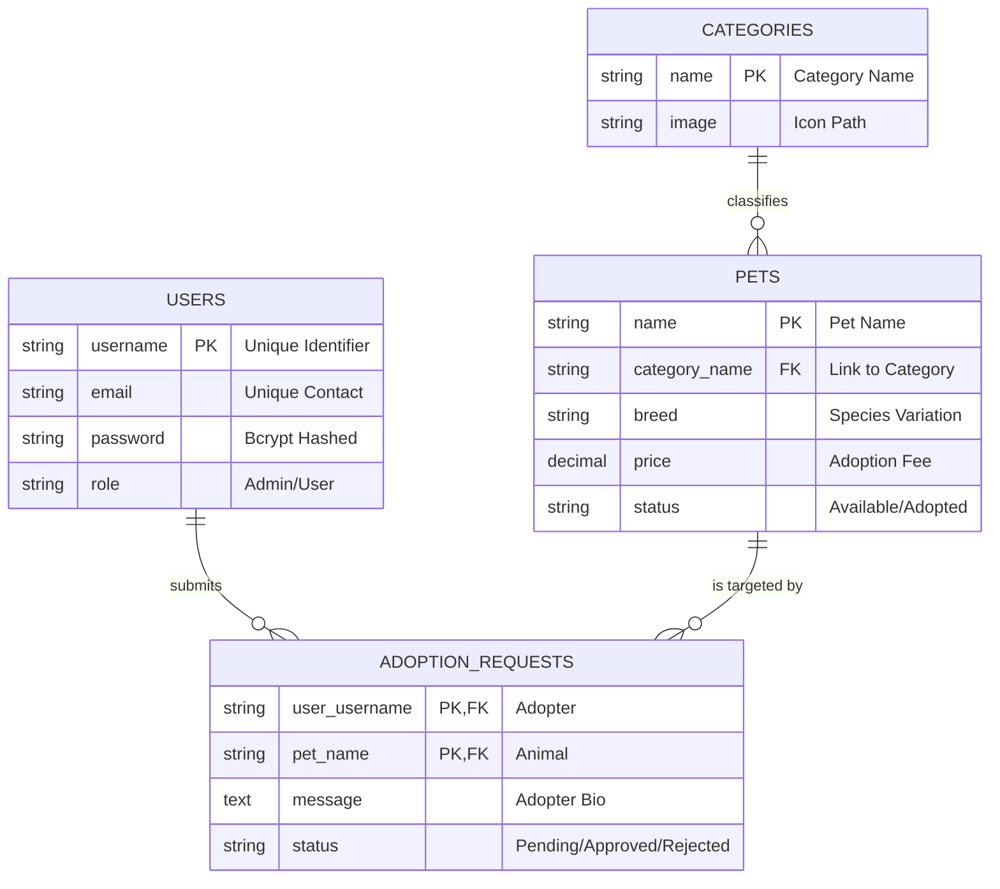
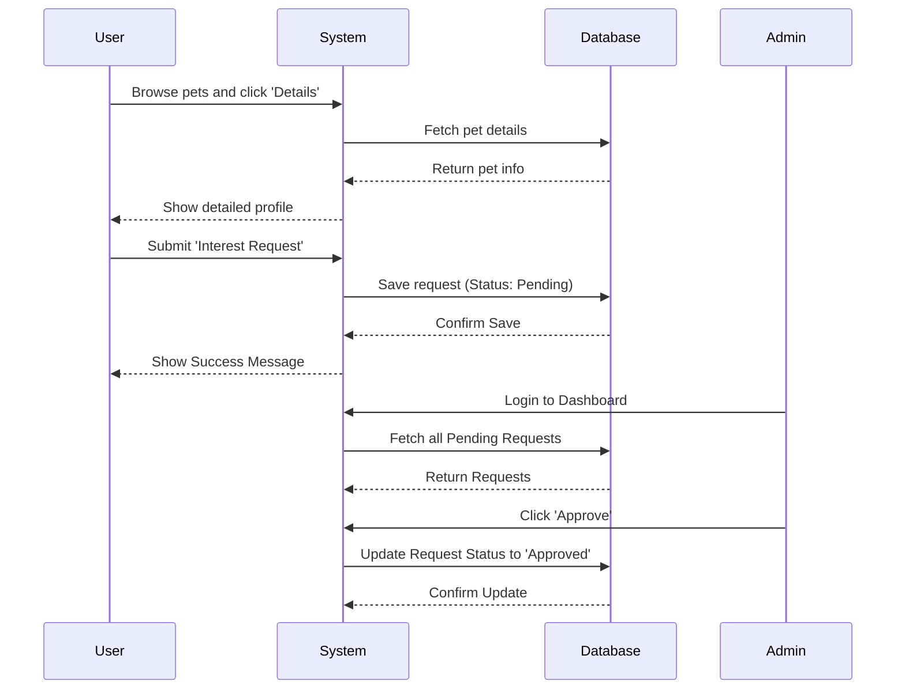

# PetHaven: Comprehensive Pet Adoption Management System
## Academic Project Report & Software Requirements Specification (SRS)
**Prepared for: Bachelor of Computer Applications (BCA) / Science Final Year Project**

---

### **1. Introduction**
#### **1.1 Overview**
**PetHaven** is an innovative, web-based platform designed to simplify and digitize the pet adoption process. In a world where countless animals in shelters await a second chance, this system serves as a bridge between specialized shelters and compassionate individuals. The platform provides a centralized, easy-to-navigate catalog of pets, categorized by species, breed, and age.

#### **1.2 Purpose**
The primary purpose of this project is to replace the cumbersome manual record-keeping used in many animal shelters with an automated, efficient, and transparent digital workflow. It ensures that every rescue animal has a digital identity that can be shared with thousands of potential adopters instantly.

#### **1.3 Objectives**
*   To provide a 24/7 accessible platform for browsing available pets.
*   To streamline the communication between shelter administrators and adopters.
*   To ensure data integrity and security for user information.
*   To provide administrators with real-time statistics regarding adoption trends.

---

### **2. Problem in Existing System**
The traditional "Pen and Paper" or "Basic Spreadsheet" systems used by many local shelters suffer from several critical flaws:
*   **Data Fragmentation**: Information about a pet's health, behavior, and history is often scattered across multiple physical files.
*   **Low Visibility**: Potential adopters must physically visit the shelter to see available pets, significantly limiting the chances of a quick adoption.
*   **Manual Tracking**: Tracking the status of an adoption request (Pending/Approved/Rejected) is done via manual phone calls or emails, leading to delays and confusion.
*   **Vulnerability**: Physical records are susceptible to damage (fire, water) and loss, with no backup mechanism.

---

### **3. Need for System**
An automated system like **PetHaven** is essential to:
*   **Accelerate Adoptions**: By providing high-quality images and detailed personal stories for each pet, the emotional connection starts online.
*   **Standardize Operations**: Every adoption request follows the same digital path, ensuring fairness and efficiency.
*   **Enhance Data Safety**: Using MySQL allows for robust data storage with backup capabilities.
*   **Improve User Engagement**: Features like search filters and personalized profiles make the process enjoyable rather than a chore.

---

### **4. Scope of Proposed System**
The system is divided into two primary interfaces:

#### **4.1 User Interface (Front-End)**
*   **Dynamic Landing Page**: Showcasing the mission and featured animals.
*   **Advanced Search & Filter**: Users can filter pets by category (Dogs, Cats, Birds, Rabbits) or search by breed and name.
*   **Detailed Pet Profiles**: Each pet has a dedicated page showing their personality, care needs, and gallery.
*   **Request Management**: Logged-in users can submit adoption interest and view their history on a personal dashboard.

#### **4.2 Administration Interface (Back-End)**
*   **Statistical Dashboard**: Visual overview of system health (Total Pets, Users, Pending Requests).
*   **Inventory Management**: Full CRUD (Create, Read, Update, Delete) capabilities for pet profiles.
*   **Decision Workflow**: One-click approval or rejection of adoption requests.

---

### **5. Feasibility Study & Fact-Finding**
#### **5.1 Feasibility Study**
*   **Technical Feasibility**: The project utilizes the **LAMP/WAMP stack** (Windows, Apache, MySQL, PHP). These are industry-standard, lightweight, and highly compatible with most hosting environments.
*   **Economic Feasibility**: The system is built using 100% open-source tools. There are zero licensing costs for the development or deployment of the system.
*   **Operational Feasibility**: The UI is designed with "Material Design" principles, ensuring that users with even minimal technical knowledge can navigate the site.

#### **5.2 Fact-Finding Techniques**
To gather accurate requirements, the following techniques were applied:
1.  **Direct Interview**: Informal discussions with local pet volunteers to understand the most common questions adopters ask.
2.  **Case Study**: Analyzing existing successful platforms like *Petfinder* to identify gaps for a localized shelter version.
3.  **Prototyping**: Building an initial wireframe of the "Search" page to get feedback on ease of use.

---

### **6. Hardware and Software Requirement**
#### **6.1 Hardware (Developer & Client)**
*   **Processor**: Intel i3 10th Gen / AMD Ryzen 3 (or better).
*   **Memory**: 4GB DDR4 (Client) / 8GB (Developer).
*   **Storage**: 100MB for source code; additional space for pet image uploads.
*   **Display**: Minimum 1024x768 resolution (Responsive design supports mobile).

#### **6.2 Software**
*   **Platform**: XAMPP v8.2.12 (Cross-Platform).
*   **Server**: Apache HTTP Server 2.4.
*   **Language**: PHP 8.2 (Backend Logic).
*   **Database**: MariaDB/MySQL (Relational Data).
*   **Styling**: Vanilla CSS3 with Flexbox and Grid layouts.
*   **Icons**: Font Awesome 6.0 CDN.
*   **Editor**: VS Code / Antigravity AI.

---

### **7. Design Specification**

#### **7.1 Entity Relationship (ER) Diagram**
The database is designed using a **Natural Key** approach for simplicity in academic presentation.

#### **7.2 UML Sequence Diagram (Adoption Flow)**

---

### **8. Data Dictionary**
**Table: `users`**
| Column | Type | Null | Key | Default |
| :--- | :--- | :--- | :--- | :--- |
| username | varchar(50) | NO | PRI | NULL |
| email | varchar(100)| NO | UNI | NULL |
| password | varchar(255)| NO | | NULL |
| role | enum('user','admin')| NO| | 'user' |

**Table: `pets`**
| Column | Type | Null | Key | Default |
| :--- | :--- | :--- | :--- | :--- |
| name | varchar(100)| NO | PRI | NULL |
| category_name| varchar(50) | YES | MUL | NULL |
| price | decimal(10,2)| YES | | 0.00 |
| status | enum('available','adopted')| NO| | 'available' |

---

### **9. Table Design & Normalization**
The system follows **3rd Normal Form (3NF)** principles:
1.  **1NF**: All columns contain atomic values; no repeating groups.
2.  **2NF**: All non-key attributes are fully functional dependent on the primary key.
3.  **3NF**: There is no transitive functional dependency. For example, `category_name` is stored in a separate table to prevent redundant storage of category icons.

---

### **10. Sample Input & Output Screens**
*   **Login Module**: 
    *   *Input*: Username/Email + Password.
    *   *System Logic*: Bcrypt verification.
    *   *Output*: Session creation and redirection to Dashboard.
*   **Pet Addition**:
    *   *Input*: Name, Photo (File Upload), Description, Fee.
    *   *Output*: New entry in `pets` table; Image saved to `assets/images/`.

---

### **11. Testing Strategy**
I followed a multi-tier testing approach:
1.  **Black Box Testing**: Testing the UI without knowing the code. (e.g., trying to submit an adoption request without being logged in—the system correctly redirects to Login).
2.  **White Box Testing**: Verifying internal code paths. (e.g., Checking if the `PDO::prepare` statements correctly prevent SQL injection by testing with escape characters).
3.  **Validation Testing**: Ensuring that integer fields (like Price) only accept numbers.
4.  **Compatibility Testing**: Running the site on Chrome, Firefox, and Edge to ensure the "Glassmorphism" effect works correctly.

---

### **12. Limitations**
*   **Offline Dependencies**: While the core logic is offline, icons rely on the Font Awesome CDN (requires internet for icons to show).
*   **Email Notification**: Currently, the system lacks an SMTP server to send instant email alerts on approval.
*   **Scalability**: The system is designed for a single shelter. Large-scale regional usage would require a "Multi-Tenant" database architecture.

---

### **13. Future Enhancement**
*   **Geolocation**: Using GPS to show pets closest to the user's location.
*   **Virtual Meet-and-Greet**: Integration with Zoom or Google Meet APIs for video calls.
*   **Pet Timeline**: A social feature where owners can upload photos of their pet *after* adoption.
*   **Vet Integration**: A digital health passport for each pet updated by verified veterinarians.

---

### **14. Conclusion**
**PetHaven** is more than just a website; it is a tool for social good. By combining professional web technologies (PHP, MySQL) with an empathetic user experience, the system successfully addresses the hurdles of modern animal rescue. It stands as a robust example of how database management and session handling can solve real-world logistical problems.

---

### **15. Bibliography**
*   **Official Documentation**: PHP 8.2 Reference Manual - [php.net](https://www.php.net/)
*   **Database Design**: "Database Systems: Design, Implementation, and Management" by Carlos Coronel.
*   **Styling**: MDN Web Docs (CSS Grid & Flexbox) - [mozilla.org](https://developer.mozilla.org/)
*   **Icons**: Font Awesome Icon Library - [fontawesome.com](https://fontawesome.com/)
*   **Frameworks**: Inspired by 'Tailwind CSS' design patterns but implemented in Vanilla CSS for academic purity.

---
**Developed and Documented by: [Student Name]**
**Subject: Final Year Computer Science Project**
